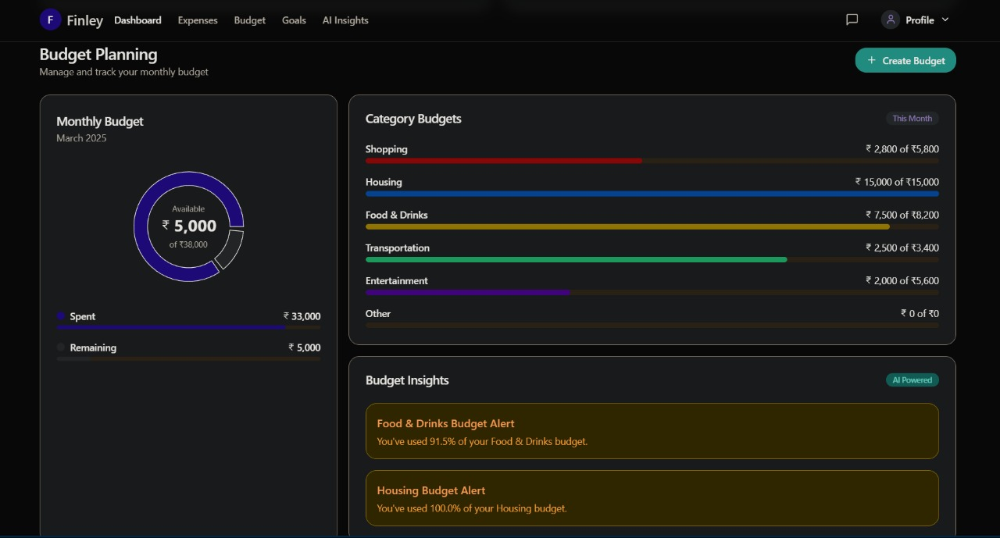
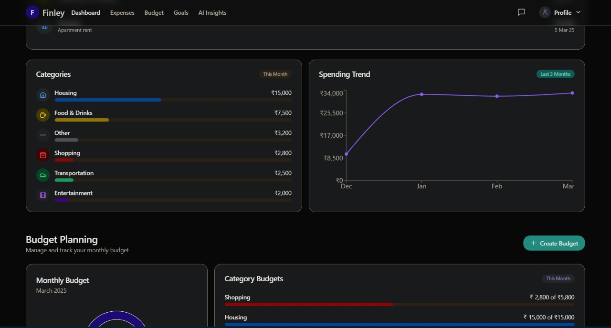

## Finley Finance Project
## Overview

Finley is an AI-powered financial advisor dashboard designed to help users manage and track their finances effectively. It analyzes user financial data, predicts optimal investment opportunities based on historical patterns, risk appetite, and financial goals, and provides actionable insights.

## Features

-Budget Planning: Manage and track monthly budgets across various categories.

-Expense Tracking: Monitor spending trends over time.

-Investment Recommendations: AI-driven predictions for optimal investment opportunities.

-Budget Alerts: Notifications for exceeding budget limits.

## Finley UI Screenshots

### Dashboard Preview

### Insights Page

## Implementation Strategy

-Extract user financial data from Supabase.

-Analyze financial behavior (income, expenses, savings, financial goals).

-Assess risk profile (low, medium, high) based on data patterns.

-Fetch and analyze stock market data from external APIs.

-Predict the best investment opportunities based on user data.

-Display investment recommendations on the frontend.

## Getting Started

-Clone the repository: git clone https://https://github.com/Adish7Pandya/finley-finance-public

-Install dependencies: npm install

-Set up Supabase environment variables.

-Run the application: npm start

## Technologies Used

-Frontend: HTML, CSS, JavaScript

-Backend: Supabase

-AI Analysis: K-Means , Random Forest , Linear Regression 

-External APIs: Stock market data APIs

## Contributing

Pull requests are welcome. For major changes, please open an issue first to discuss what you would like to change.

## License

MIT
